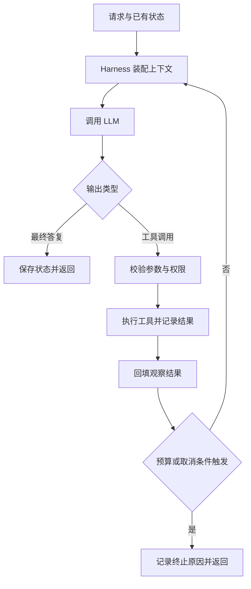

# Day 01：Agent = LLM + Harness

日期：2026-09-06。状态：教材完成，练习与项目源码验证待完成。

## 今天要解决的问题

参与过 Agent 项目，却无法准确解释“模型做了什么、框架做了什么、业务系统负责什么”，很容易在设计和面试中混淆边界。今天先建立一张能用于追踪源码的职责地图。

学习目标和验收见 [SDD 规格](../../docs/sdd-spec.md)。读完后完成 [练习](exercises.md)，再写 [复盘](retrospective.md)。

## 1. 怎样理解这个公式

**教学抽象：Agent = LLM + Harness。**

LLM 根据输入上下文产生输出，例如文本、结构化数据或工具调用请求。Harness 是组织模型调用、执行动作、反馈结果和管理运行过程的外部系统。模型提出调用工具，并不等于工具已经执行成功。

这是现代 Agent 工程中常用且有用的抽象，不是数学等式，也不是所有文献统一采用的正式定义。它帮助我们从“模型外面加几个组件”转向检查完整的运行闭环。具体任务不一定需要下表的全部能力。

## 2. 职责边界

以下表格是本课程的工程设计框架；实际系统可以把职责分散在框架、业务服务和基础设施中。

| 职责 | LLM 提供什么 | Harness/应用负责什么 |
|---|---|---|
| 决策与输出 | 生成答复或下一步行动请求 | 组织输入、解析输出、决定流程如何推进 |
| 工具调用 | 工具名与参数候选 | 参数校验、权限判断、执行、超时与结果回填 |
| 上下文 | 使用本次可见信息 | 选择历史、检索资料、装配指令、控制长度 |
| 状态 | 生成计划或进度描述 | 保存真实状态、维护任务标识、恢复执行 |
| 停止 | 输出最终答复或停止意图 | 执行步数、时间、成本与取消限制 |
| 可靠性 | 根据错误信息调整下一步 | 重试策略、幂等、副作用记录、失败处理 |
| 观测与验收 | 输出可供评价的结果 | 记录调用轨迹、耗时、费用、运行评测 |

“模型懂权限”不等于系统做了权限校验；“模型说已保存”也不等于持久化成功。模型输出是一种输入，真实执行结果来自运行系统。

Harness 可以调用独立的 sandbox、数据库、检索服务；这些服务不必物理上都装在同一个进程里。

## 3. ReAct 在什么位置

ReAct 原论文讨论推理与行动交替，使模型利用行动获得的信息继续推进任务。工程实现通常采用“模型输出 → 工具执行 → 观察结果回填 → 再次调用模型”的闭环。[ReAct 原论文](https://arxiv.org/abs/2210.03629)

ReAct 是可以由 Harness 承载的一种策略。Harness 还要处理循环以外的执行和治理。现代工具调用实现也不一定输出显式的 Thought 文本；没有可见思考文本不代表没有决策过程。

这是一张教学流程图，省略了流式输出、并行工具、审批暂停等分支。被拒绝的调用可以变成错误观察或终止，取决于系统策略。

## 4. 用一条请求看清闭环

用户问：“查一下订单 A 的状态，并告诉我下一步怎么办。”

1. 应用识别用户身份和可访问的数据范围，恢复必要状态。
2. Harness 把指令、问题及可用工具描述交给模型。
3. 模型产生查询订单的工具调用。
4. 工具执行层验证参数与访问权限，查询业务服务。
5. Harness 把真实返回值关联到这次工具调用，加入上下文。
6. 模型依据结果生成答复，或者请求进一步查询。
7. 系统执行终止检查并保存需要的状态。

这里的业务例子是假设场景，不描述用户项目的已验证行为。若工具已产生副作用但进程在记录结果前崩溃，下次执行必须判断上次是否成功；直接重试可能造成重复操作。

## 5. 映射到当前 AgentScope Java 项目

**用户提供背景：项目基于 AgentScope 的 Java Agent。当前业务源码和依赖锁定版本尚未核对。**

AgentScope Java 官方仓库展示了 ReActAgent 及模型、工具等框架能力；当前上游已包含更新的 Harness 设计。不能把上游 main 的能力反推为旧项目已经具备。[AgentScope Java 官方仓库](https://github.com/agentscope-ai/agentscope-java)

| 概念 | 项目中应该查什么 | 当前证据状态 |
|---|---|---|
| LLM | 模型适配器、请求参数、实际调用入口 | 待源码验证 |
| Loop | ReActAgent 构造与执行入口、迭代计数和终止判断 | 待源码验证 |
| Tool | 工具注册、参数 schema、执行器和异常处理 | 待源码验证 |
| Context | Memory 读取、prompt 装配、截断或压缩触发点 | 待源码验证 |
| Session | 请求间保存/加载哪些字段、何时调用 | 待源码验证 |
| Task State | 未完成步骤、工具结果和恢复点如何保存 | 待源码验证 |
| 业务边界 | 身份、数据权限、事务、幂等约束在哪一层 | 待源码验证 |
| 观测 | trace ID、模型与工具耗时、失败原因 | 待源码验证 |

核对时记录：项目提交 SHA、依赖版本、类/方法、观察到的行为，以及能推翻结论的情况。旧对话出现的 MysqlSession、AutoContext、MemOS 等名字仅可作为后续检索线索，本章不确认其存在或行为。

## 6. 四个容易混淆的量

- 用户轮次：用户发起交互的次数。
- 模型调用次数：实际请求模型的次数，一轮用户交互可以调用多次。
- ReAct iteration：实现定义的循环步数，需要检查计数位置。
- 消息条数：上下文中消息对象数量，可能含用户、助手、工具结果等。

所以看到“100”必须先确认单位、默认值、覆盖配置和触发行为。消息阈值不自动等于 100 轮会话；iteration 上限也不自动等于整个 Session 的生命周期上限。

## 7. 从运行到可靠运行

一个循环能调用工具，只说明执行路径走通。要能连续完成任务，还需要进度记录、可恢复状态和实际验收。Anthropic 的长任务实践展示了通过初始化环境、逐步推进和交接记录衔接多个上下文窗口；也指出仅压缩上下文不足以保证任务完成。[长任务 Harness 实践](https://www.anthropic.com/engineering/effective-harnesses-for-long-running-agents)

这也是本仓库使用 SDD 的原因：明确完成标准，记录证据，再决定是否完成一章。

## 自检

能否闭卷解释：模型输出 tool call 后谁执行？ReAct 为什么只是整体的一部分？Session 恢复为什么不自动等于故障恢复？项目中哪些结论你已经亲自验证？

下一章：[Runtime 生命周期与学习路线](../../docs/learning-roadmap.md)。
